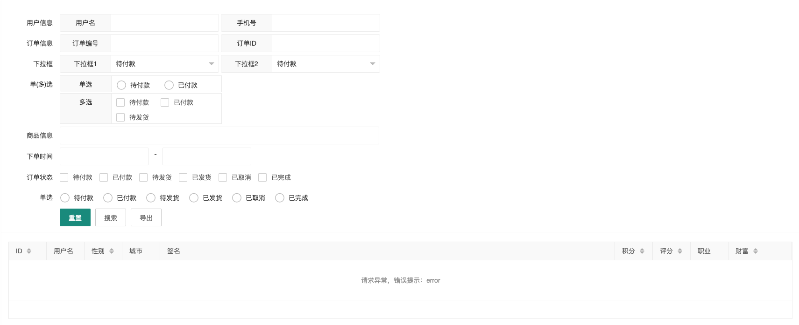

# Layui DataTable 

> 基于 Layui 的数据表格封装，绑定搜索表单，减少每次编写表单的内容，方便维护

根据配置信息生成form表单，自动绑定搜索事件，数据表格刷新搜索等

### 依赖

- Layui 2.6.8

### 截图



### 使用说明

```js
// html 
<div id="test_datatable_filter"></div>

// js
layui.config({
    base: './plugin/', //静态资源所在路径
    dir: './plugin/'
}).use(['dataTable'], function() {
    let dataTable = layui.dataTable;
    dataTable.render({
        el:"#test_datatable_filter"
    })
});

```


- render 参数说明

| 配置字段 | 备注说明     | 字段类型 | 示例值  |
|------|----------|----|----|
| el | 对象ID | string | #test |
| form | 搜索表单配置字段 | object | {} |
| form.lay_filter | 表单绑定的lay-filter | string | form_test |
| form.btn | 扩展的表单按钮配置 | array | `[{name:'导出',lay_filter:'test',url:'test',method:'POST',query:{is_export:1}}]`|
| form.btn.name | 按钮显示的内容 | string | form_test |
| form.btn.lay_filter | 按钮绑定的lay-filter | string | form_test |
| form.btn.url | 按钮提交的url | string | form_test |
| form.btn.method | 请求方式 | string | `GET|POST` |
| form.btn.query | 请求参数扩展 | object | `{is_export:1}` |
| form.btn.onclick | 按钮点击回调函数 | function |  |

